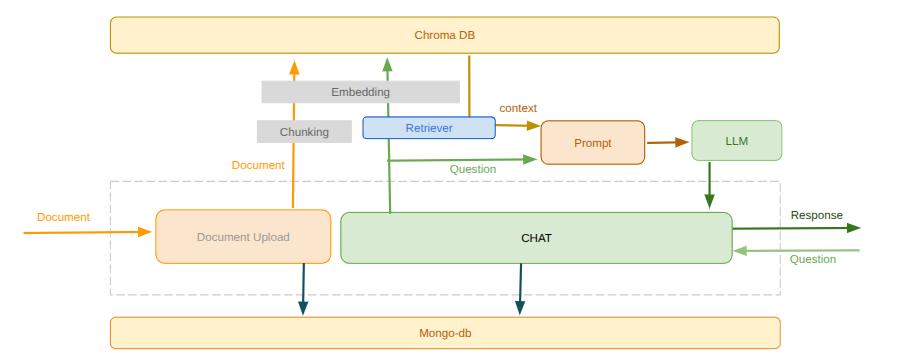

# PDFChat-RAG

A simple example of Retrieval-Augmented Generation (RAG) application with basic functionality.  
 **PDFChat-RAG** is a modular, containerized application that enables semantic search and chat over PDF documents using RAG. Built with Flask, Celery, Ollama, ChromaDB, and more, it provides an end-to-end pipeline for uploading, and conversing with PDF documents using local language models.


## 🚀 Features

- 📄 **Upload PDFs** and extract embedded text
- 🔍 **Semantic search** over vector embeddings using [ChromaDB](https://www.trychroma.com/)
- 💬 **Chat interface** for querying document content via RAG
- 🧠 **LLM integration** using [Ollama](https://ollama.com/)  
- 🧰 **Background processing** with Celery & Redis
- 🗂️ **Metadata storage** in MongoDB

## 🧱 Architecture



 


## 🐳 Dockerized Services

 | Container   | Role                                              |
| ----------- | -------------------------------------------------- |
| `flask-app` | PDF upload, RAG chat UI/API                        |
| `ollama`    | Hosts and serves LLM models                        |
| `celery`    | Runs background tasks  |
| `redis`     | Pub/sub and Celery broker                          |
| `chromadb`  | Stores and queries vector embeddings               |
| `mongodb`   | Stores app metadata and user sessions              |


### Clone the Repo
``` bash
git clone https://github.com/darshanz/pdfchat-rag.git
cd pdfchat-rag
```

### Start the App
``` bash
docker-compose up --build
```
This will start all containers. Access the app at http://localhost:5000


### TODO
- Include support for multiple files
- User loging/auth
- Save chat history for given pdf
- Extracts images and tables from the document and Include in chat responses

## 📜 License

This project is licensed under the [MIT License](LICENSE).
